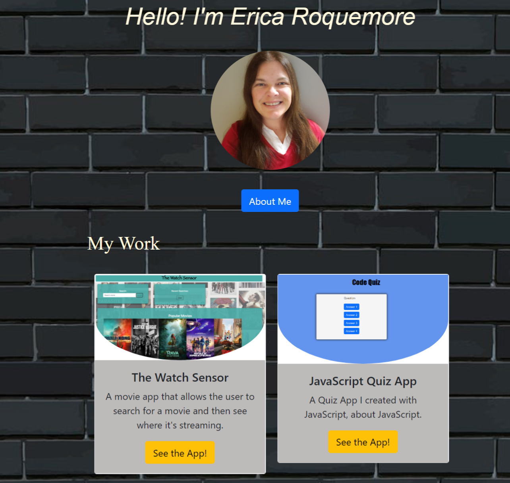

# My Portfolio 2.0

My updated portfolio showcasing the skills that I've acquired thus far in my education.

# Screenshot

 

# Deployed Application

* [Portfolio](https://ricapi96.github.io/portfolio-updated/)

# Resources and Contributers

## License

                                        💙 Made by Erica Roquemore 💙